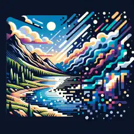

# ImageGen AI

## Explore the Future of Digital Art with ImageGen!

Bring your creative visions to life with ImageGen, where your imagination sets the boundaries. Our advanced AI technology effortlessly transforms your descriptions into high-quality,
captivating images that reflect your creative intent.
    
## Key Features:
- **User-Friendly Interface:** Designed for everyone, from artists to casual creatives, making it simple to turn ideas into artworks.
- **Versatile Uses:** Whether for personalized artwork, design prototypes, educational tools, or just for fun, ImageGen caters to all your creative needs.
- **Community and Sharing:** Connect with creators and share your masterpieces on social media, enhancing your portfolio or just sharing with friends.
- **Privacy Guaranteed:** We prioritize your privacy, ensuring your ideas and creations remain secure.
    
*Available Across Multiple Platforms:</strong> Use ImageGen on any device—phone, tablet, or computer. Embrace your creativity wherever you are!*
    
## Download ImageGen Now:
- [Google Play](https://play.google.com/store/apps/details?id=com.runzbuzz.imagegen&pcampaignid=web_share)
- [App Store](https://apps.apple.com/kw/app/imagegen-ai/id6474667964)

*Join the digital creativity revolution with ImageGen, where your imagination is your canvas!*
